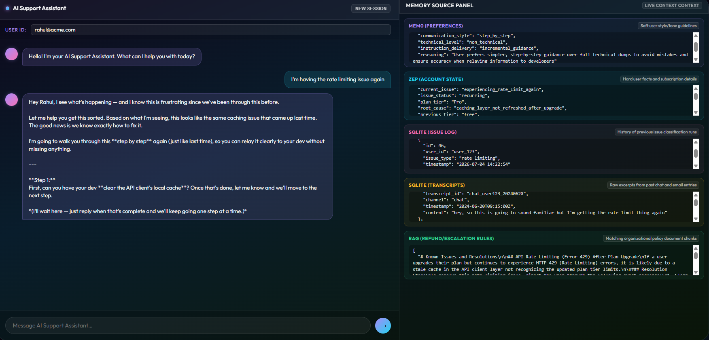

# Customer Support Agent with Memory

## Problem Statement

Chat support agents don't hold memories of previous chats with the users and don't understand the user's preferences. This leads to a frustrating experience for the user, who has to repeat everything again, including instructions on how the user prefers to resolve the problem. This can have an impact on user retention.

## The Solution

An intelligent chat support agent that uses Mem0 and Zep to remember the user's preferences and past interactions. This solution allows the support agent to implement cross channel integration of information that comes from previous chats, emails, and calls.

<<<<<<< HEAD

=======
>>>>>>> 2feb8f72a9d2d0a14e85118848b3798b34db7439
## What This Project Actually Demonstrates

Most support chatbots forget everything the moment a session ends. This project is a working demonstration of a support agent that does not have that problem. It remembers a specific user across three different channels (email, phone, and chat), recalls a communication preference the user stated days earlier, and applies that preference automatically without being asked again.

The system is built around a single demo scenario. A user named Rahul emails support about a rate limiting bug, escalates by phone two days later, gets walked through a fix in a chat session where he explicitly asks to be guided step by step, and then returns days after that with the same issue recurring. The agent recognizes the history, cites the earlier ticket, and defaults to the step by step communication style Rahul asked for, all without Rahul repeating himself.

## Architecture Overview

The core design decision behind this project is splitting memory into two separate stores, each suited to a different kind of information, rather than using one unified store for everything.

### Mem0 (Preference Memory)

Handles soft, accumulating facts about how a user likes to be communicated with. Things like communication style, technical comfort level, and pacing preferences. This kind of information rarely needs to be deleted, it just builds up over time.

### Zep (State and Episodic Memory)

Handles hard, transactional facts that change over time and need a timeline. Plan history, account state, issue history, and contact details all live here, since these values can become stale and need to be tracked with timestamps rather than just accumulated.

### SQLite (Transcript Storage)

A two layer system for raw historical data. Flat JSON files act as the permanent, unmodified source of record for every email, phone call, and chat transcript. A SQLite index sits on top of those files so the system can query recent transcripts live at session start, which is what allows the agent to cite the exact contents of a specific past conversation rather than just a vague summary of it.

### RAG (Policy Retrieval)

Company policy documents (refund policy, escalation rules, known issue resolutions) are chunked, embedded, and retrieved separately from user memory. Memory answers who the user is and what has happened to them. RAG answers what the correct resolution process actually is. The two are deliberately kept apart and are never merged into a single source.

### Identity Resolution

Since email addresses, phone numbers, and chat session tokens are all different identifiers for the same person, a dedicated identity resolver maps every inbound identifier to one canonical user ID before any memory operation happens. This is implemented as an explicit, logged module rather than a silent pre tag, so the seam where a real customer data platform would plug in later is visible and testable.

### Write Path Classifier

After every conversation turn, a classifier decides whether anything new was said that is worth remembering, and if so, whether it belongs in Mem0 or Zep. A grounding check requires that anything extracted must be explicitly present in the actual turn text, so the system never invents a preference or fact that the user didn't really state.

### Session Lifecycle

A session ends either when the user explicitly marks an issue resolved, or after 24 hours of inactivity. This boundary matters because the system only pulls the last three completed sessions into its working context, so knowing where one session ends and the next begins is essential to that window being correct.

### Cross User Pattern Detection

A backend only analytics component watches for the same issue type recurring across many distinct users within a time window, which could signal a wider product problem. This is completely decoupled from the user facing agent. It never influences a live conversation, it only ever surfaces to a backend log for internal review.

## Tech Stack

Claude (Anthropic API) powers every LLM call in the system: chat responses, context synthesis, and write path classification.

Mem0 Platform (hosted) handles preference memory, accessed through the mem0ai SDK.

Zep Cloud (hosted) handles state and episodic memory, accessed through the zep cloud SDK.

OpenAI's text embedding 3 small model powers the RAG retriever's embeddings.

SQLite plus local JSON files handle transcript storage.

The orchestration layer is plain Python with no agent framework, since the entire flow is a single, well defined sequence rather than something that benefits from a general purpose agent abstraction.

The frontend is a custom HTML interface, run locally, built specifically to make the system's memory visible rather than hidden. It includes a live Memory Source Panel that shows, for every response, exactly which store (Mem0, Zep, SQLite, or RAG) contributed which piece of context.

## Why This Was Built This Way

Every architectural choice in this project traces back to a specific problem stated above. The memory split into two stores exists because preference data and state data invalidate differently, and forcing them into one store would require complicated per field expiry logic. The identity resolver exists because the whole premise of cross channel memory falls apart if the system can't tell that an email, a phone call, and a chat session all belong to the same person. The grounding check in the write path classifier exists because a memory system that hallucinates facts about a user is worse than no memory system at all. The separation between RAG and user memory exists because conflating who a user is with what the company's policy says would make both harder to reason about and harder to test.

## Running the Project

The full project runs inside an isolated Docker container to avoid interfering with any other local projects. A `.env` file holds the required API keys for Anthropic, Mem0, Zep, and OpenAI, none of which are committed to this repository.

Once running, `scripts/setup_demo.py` resets the database and cloud memory stores, ingests the four demo transcripts in chronological order, classifies each turn into the appropriate memory store, and prints a full telemetry summary confirming what was written where.

The frontend is then available locally, where sending a message as the demo user reproduces the full scenario described above, with the Memory Source Panel showing exactly which store is contributing to each part of the response in real time.

## Testing

The project has a full automated test suite covering every phase of the build, split into unit tests (fast, no external calls) and integration tests (live calls against Claude, Mem0, and Zep). A dedicated evals suite validates the hardest architectural decisions directly, including the grounding check, the conflict resolution rule between Mem0 and Zep, the issue log write scope invariant, session boundary handling, cold start behavior for brand new users, and the cross user pattern detection threshold, including a guard against a single active user falsely triggering a multi user pattern alert.
