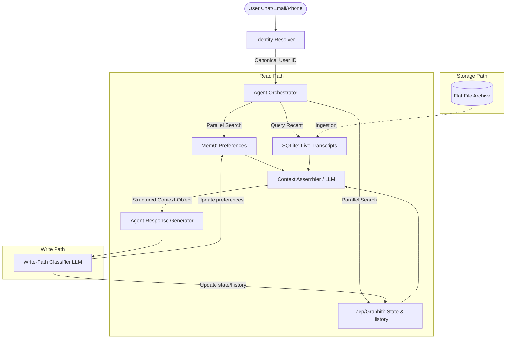

# Customer Support Agent with Memory (Mem0 + Zep) — Project Context

This document captures the architecture, decisions, schema, and design patterns for the **Customer Support Agent with Memory** project. It serves as the single source of truth for the project's context.

---

## 1. Problem & Solution Overview

### The Problem
Traditional customer support chat agents lack memory across sessions and fail to capture user-specific preferences. This results in a disjointed user experience where users must repeatedly explain past issues and specify preferences (e.g., communication style, resolution preferences), leading to customer frustration and decreased retention.

### The Solution
An intelligent support agent leveraging **Mem0** and **Zep** to deliver persistent user memory and omnichannel context. The agent retains context across chat, email, and phone interactions, enabling:
- Consistent behavior adapted to user-expressed preferences.
- Immediate awareness of ongoing issues and past resolutions.
- System-level pattern detection for cross-user issues.

---

## 2. Architecture & Components

The system architecture divides responsibilities across specialized memory systems, raw storage layers, and orchestration components.



### 2.1 Memory Separation Strategy

The system splits the memory layer based on the lifetime and characteristics of the information:

1. **Mem0 (Preference Memory):**
   - **Characteristics:** Soft facts, communication styles, and platform configurations that build up over time and rarely require deletion.
   - **Examples:** `"prefers concise replies"`, `"always uses dark mode, on mobile"`, `"prefers step-by-step guidance"`.

2. **Zep/Graphiti (State & Episodic Memory):**
   - **Characteristics:** Transactional facts, timelines, structural state changes, and relationship mappings. This memory represents facts that may become stale or require historical tracking.
   - **Examples:** Subscription plan status (e.g., `Free → Pro`), issue resolution state, account details (e.g., billing email changes), and entity relations.

### 2.2 Identity Resolution Service

To enable omnichannel linking (chat sessions, email, phone calls) to a single user profile, the project uses a deterministic mapping layer:

- **Module:** `identity_resolver.py`
- **Implementation:** Explicit deterministic dictionary mapping input channel identifiers to a canonical `user_id`.
- **Purpose:** By explicitly logging and encapsulating this resolution step, the project provides a clean architectural seam where a production CDP (Customer Data Platform) or probabilistic resolver could be inserted later.

```python
def resolve_user_id(identifier: str) -> str:
    mapping = {
        "rahul@acme.com": "user_123",
        "+91-9876543210": "user_123",
        "sess_abc_789":   "user_123",
    }
    user_id = mapping.get(identifier, "unknown_user")
    logging.info(f"Identity resolved: {identifier} → {user_id}")
    return user_id
```

### 2.3 Two-Layer Transcript Storage

Transcripts are independent, immutable audit trails. They are stored in two layers:

1. **Flat File Layer (Raw Intake):**
   - Files are stored as channel-tagged JSON documents (e.g., `email_user123_20240612.json`).
   - Immutable; represents raw evidence of the interaction.

2. **SQLite Layer (Queryable Index):**
   - An ingestion script parses flat files and populates a SQLite table:
     ```sql
     CREATE TABLE transcripts (
         transcript_id TEXT PRIMARY KEY,
         user_id TEXT,
         channel TEXT,
         timestamp DATETIME,
         content TEXT
     );
     ```
   - Hit at session startup to extract direct quotes or reference materials.

---

## 3. Session Lifecycle & Data Schema

### 3.1 Session Initialization (Prep State)

When a user initiates contact, a multi-source parallel read gathers context before the agent generates a response.

```
                  +-----------------------+
                  |  User Session Starts  |
                  +-----------+-----------+
                              |
                     [Parallel Fetch]
             /----------------+----------------\
            v                 v                 v
     +------------+    +------------+    +-------------+
     |    Mem0    |    |    Zep     |    |   SQLite    |
     | Preference |    | Account &  |    | Transcript  |
     |  Context   |    |  History   |    |  Excerpts   |
     +------+-----+    +------+-----+    +------+------+
            \-----------------+----------------/
                              |
                              v
                  +-----------------------+
                  |   Scoped LLM Synthesizer|
                  +-----------+-----------+
                              |
                              v
                  +-----------------------+
                  |  Structured Context   |
                  |     JSON Schema       |
                  +-----------------------+
```

The context from Mem0, Zep, and the SQLite query is compiled using a constrained LLM into a fixed structured JSON schema:

```json
{
  "preferences": {},
  "account_state": {},
  "issue_history": [],
  "transcript_excerpts": []
}
```

- **Token Budget / Window Constraint:** To keep the prompt lean, only context from the **last 3 previous sessions/transcripts** is injected into the context object. These session boundaries are defined in [Section 3.2: Session Definition](#32-session-definition).
- **Cold-Start Handling:** If all memory stores are empty, the schema's empty structure represents a new user naturally; no special routing path is needed.

### 3.2 Session Definition

A session ends when either:
- The user explicitly marks the issue as resolved (closes the chat), or
- 24 hours pass with no activity — the session auto-expires and is marked complete.

This boundary definition is critical because the context window cap (which limits historical context to the last 3 sessions/transcripts) relies on these session limits to prune history.

### 3.3 Conflict Policy

When Mem0 and Zep return conflicting information during context assembly (e.g., a stale Mem0 preference vs. Zep's current state), the system applies the following default resolution rule:
- **Zep wins on facts:** Since Zep tracks factual states and transaction history, its records override.
- **Mem0 wins on tone/style:** Since Mem0 tracks softer communication preferences, its records override.

These two stores should not genuinely overlap since they hold different categories of information by design. Thus, this conflict policy is a safety fallback, not expected to trigger often. It is noted as a secondary evaluation case to test, rather than a blocking design decision.

### 3.4 Write Path & Memory Saving

After each user turn, the interaction is analyzed by a write-path classifier LLM:
1. **Evaluation Check:** The LLM checks if the extracted preference/fact is explicitly grounded in the conversation turn.
2. **Classification:** It classifies the data and routes updates:
   - **Mem0:** Save if preference/style data.
   - **Zep:** Save if transactional state or issue history.
   - **Discard:** If no new memory/state updates are detected or if it fails the grounding test.
3. **Trigger Scenarios:**
   - Saved dynamically during live chat sessions.
   - Saved automatically during asynchronous email/phone ingest pipeline actions.

---

## 4. Grounding & Static Data Ingestion

The agent references company static assets for rules and resolution guidelines, kept separate from user-specific memories:

- **Asset Types:** Hand-crafted policy guides, refund policies, and escalation processes.
- **Storage & Retrieval:** Kept in standard local files and retrieved via a standard **RAG (Retrieval-Augmented Generation)** workflow.
- **Usage:** Combined at inference time in the agent prompt alongside the Structured User Context. Memory tells the agent *who the user is*; RAG tells the agent *how to resolve the issue*.

---

## 5. Memory Retention Policy

Contact Details (phone, email) are modeled as a Zep-tracked entity type (never conflated with Mem0 preferences). Their retention rule dictates overwriting on update, with the old value deleted (not retained or historically saved like Plan History or Payment Info).

| Memory Category | Storage Target | Retention Rule |
| :--- | :--- | :--- |
| **Plan History** | Zep | Retain forever (full history) |
| **Issue History** | Zep | Retain forever |
| **Payment Information** | Zep | Retain current only (overwrite old) |
| **Chat Preferences** | Mem0 | Retain forever |
| **Other Preferences** | Mem0 | Expire at session end |
| **Contact Details** | Zep (Entity Type) | Overwrite on update (delete old, never conflated with Mem0) |

---

## 6. Cross-User Pattern Detection

To detect wide-scale product issues spanning multiple users, the system tracks issues globally:
- **Log Table:** A shared SQLite table tracks issue categorizations globally (`user_id`, `issue_type`, `timestamp`).
- **Logic:** A periodic keyword query flags issue types that cross a threshold frequency (e.g., $X$ times in $Y$ days).
- **Presentation:** Surfaced only inside a backend dashboard/PM view. **Never** displayed to the user or injected into the chat context.

---

## 7. Technology Stack

- **LLM API:** Claude (Anthropic API) — handles chat responses, synthesis, write classification, and RAG.
- **Preference Memory:** Mem0 (hosted Platform API, python SDK `mem0ai`).
- **State Memory:** Zep (hosted Cloud API, python SDK `zep-cloud`). Client initialization only requires the API key (defaults to hosted endpoint):
  ```python
  from zep_cloud.client import Zep
  client = Zep(api_key=os.environ.get("ZEP_API_KEY"))
  ```
- **Transcripts Database:** SQLite + Local JSON Flat Files.
- **Orchestration:** Python (pure orchestrator, avoiding heavy frameworks like LangChain).
- **Web Interface:** Custom wireframed HTML page (hosted locally) showing the chat dialogue alongside a real-time visualization of the memory sources.

---

## 8. Setup & Development Flow

### Docker Environment (Phase 0)
- Isolated Docker environment is configured on non-conflicting ports (avoiding port `5433` occupied by other projects).
- Essential libraries to install: `mem0ai`, `zep-cloud`.

### Target Demo User Journey
The system is built to demo a single deep multi-touchpoint user journey:
1. **Email:** User reports an issue.
2. **Phone Call:** User escalates the issue (call transcript is ingested).
3. **Chat Session:** User specifies a preference (e.g., `"walk me through this step by step"`).
4. **Subsequent Chat:** User returns. The agent must:
   - Recognize the ongoing issue from Zep/SQLite history.
   - Deliver instructions step-by-step per the Mem0 preference profile.
   - Reference details from the earlier email and phone call transcript.

---

## 9. Evals & Testing Plan

To ensure correctness and prevent regressions, the memory and orchestration layers are validated against the following evaluation and test scenarios:

### 9.1 Grounding Checks
- **Validation:** Every memory save operation (write path) is checked by an LLM parser to ensure that the extracted preference or fact is explicitly present and grounded in the immediate conversation turn. If the content does not exist in the turn, the update is discarded.

### 9.2 Conflict Policy Validation
- **Test Case:** Simulating a scenario where Mem0 returns a stale user preference (e.g., `"prefers verbose, detailed updates"`) that conflicts with a new state fact stored in Zep (e.g., a specific account state indicating a quick fix is needed).
- **Expected Outcome:** Confirming that the system correctly overrides the fact using Zep while maintaining the communication tone/style from Mem0, per the Zep-wins-on-facts default resolution rule.

### 9.3 Correctness Verification Scenarios
- **Prep-State Context Assembly:** Verify that parallel queries to Mem0, Zep, and SQLite transcripts are merged accurately into the unified JSON context schema without syntax errors, data leakage, or loss of information.
- **Write-Path Classification Accuracy:** Test the LLM classifier's precision in assigning incoming facts/preferences to the appropriate memory stores (routing preferences to Mem0, and routing transactional/state updates to Zep).
- **Session Boundary Handling:** Test the session expiration hook (auto-expiring after 24 hours of inactivity) and explicit close event to confirm they correctly reset session contexts and prune the historical token budget to the last 3 sessions/transcripts.
