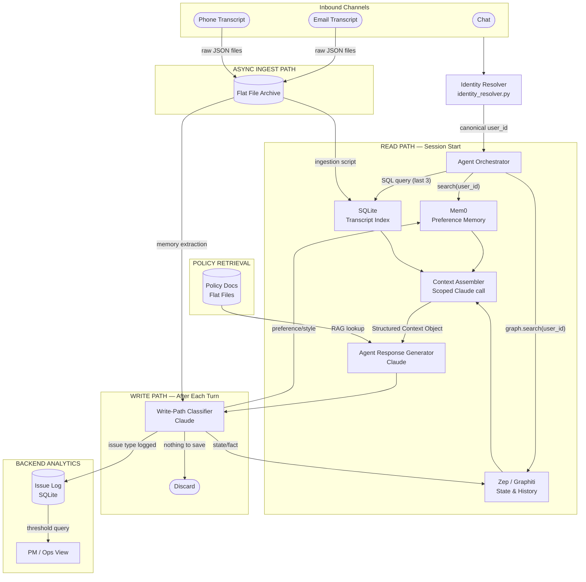
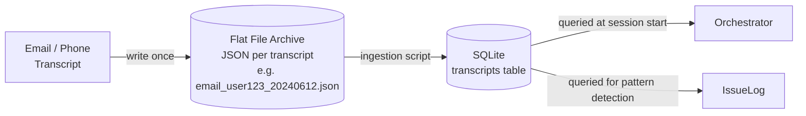
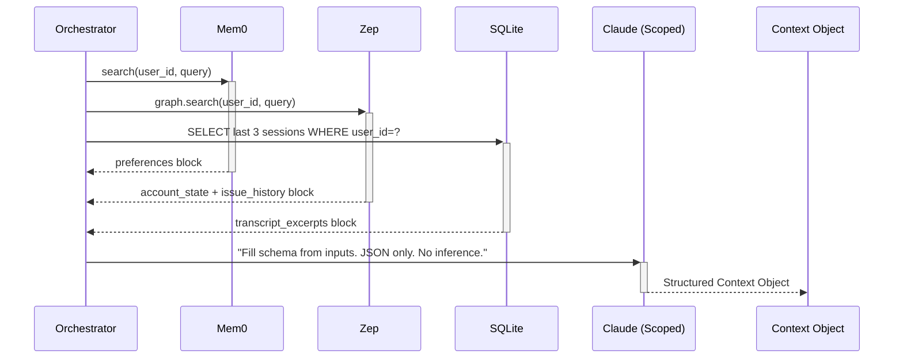
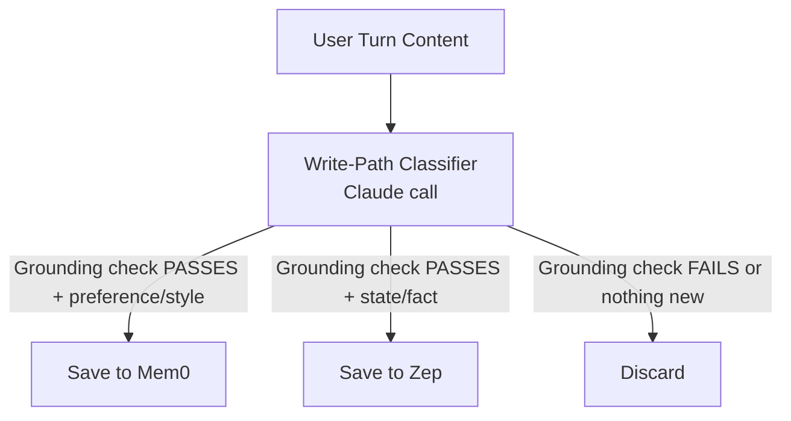
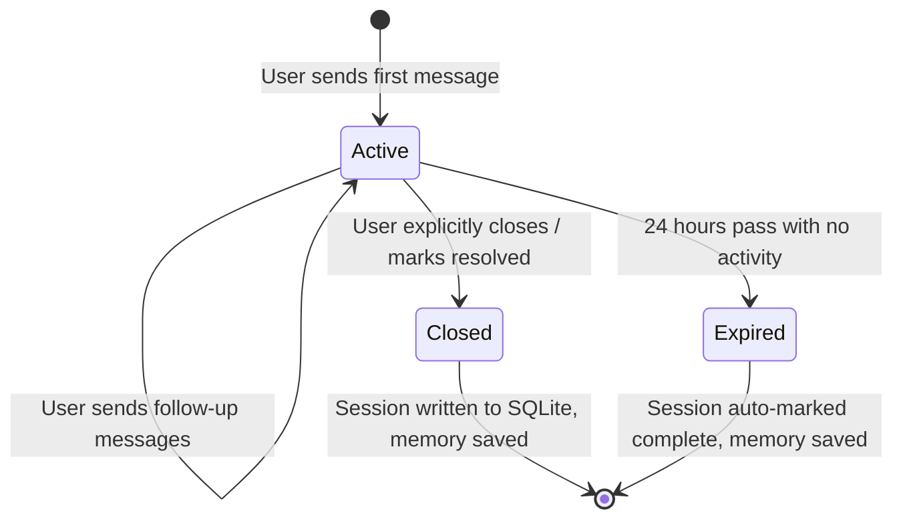
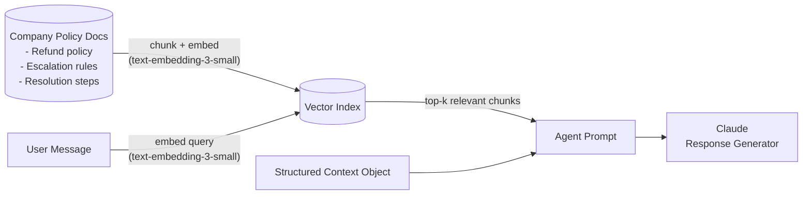

# Architecture — Customer Support Agent with Memory

> **Scope:** This document is the authoritative technical reference for the system design of the Customer Support Agent with Memory project. It covers every architectural layer — from inbound channel handling through memory reads, context assembly, LLM response generation, write-path classification, and storage — along with all design decisions, data schemas, and conflict policies.

---

## Table of Contents

1. [System Overview](#1-system-overview)
2. [High-Level Architecture](#2-high-level-architecture)
3. [Component Reference](#3-component-reference)
   - 3.1 [Identity Resolver](#31-identity-resolver)
   - 3.2 [Agent Orchestrator](#32-agent-orchestrator)
   - 3.3 [Memory Stores](#33-memory-stores)
   - 3.4 [Transcript Storage](#34-transcript-storage)
   - 3.5 [Context Assembler (Prep State)](#35-context-assembler-prep-state)
   - 3.6 [Agent Response Generator](#36-agent-response-generator)
   - 3.7 [Write-Path Classifier](#37-write-path-classifier)
   - 3.8 [RAG Policy Retriever](#38-rag-policy-retriever)
   - 3.9 [Cross-User Pattern Detector](#39-cross-user-pattern-detector)
4. [Data Flows](#4-data-flows)
   - 4.1 [Inbound Message Flow (Read Path)](#41-inbound-message-flow-read-path)
   - 4.2 [Memory Write Flow (Write Path)](#42-memory-write-flow-write-path)
   - 4.3 [Async Transcript Ingestion Flow](#43-async-transcript-ingestion-flow)
5. [Session Lifecycle](#5-session-lifecycle)
6. [Data Schemas](#6-data-schemas)
   - 6.1 [Structured Context Object](#61-structured-context-object)
   - 6.2 [Transcript Database Schema](#62-transcript-database-schema)
   - 6.3 [Cross-User Issue Log Schema](#63-cross-user-issue-log-schema)
7. [Memory Architecture](#7-memory-architecture)
   - 7.1 [Memory Separation Rationale](#71-memory-separation-rationale)
   - 7.2 [Memory Retention Policy](#72-memory-retention-policy)
   - 7.3 [Conflict Resolution Policy](#73-conflict-resolution-policy)
8. [RAG Integration](#8-rag-integration)
9. [Technology Stack](#9-technology-stack)
10. [Environment Configuration](#10-environment-configuration)
11. [Evals & Testing Plan](#11-evals--testing-plan)

---

## 1. System Overview

Traditional customer support agents treat each session as stateless — users must re-explain their history, repeat preferences, and re-establish context on every contact. This system solves that by layering a dual-store persistent memory architecture over a Claude-powered conversational agent.

**Core capabilities enabled by this architecture:**

| Capability | Mechanism |
| :--- | :--- |
| Preference persistence across sessions | Mem0 preference memory store |
| Full issue history and account state | Zep/Graphiti state memory store |
| Omnichannel identity linking | `identity_resolver.py` deterministic mapping |
| Direct transcript reference ("the email from June 12") | SQLite queryable transcript index |
| Policy-grounded resolution answers | RAG over company policy documents |
| Cross-user product issue detection | Shared SQLite issue log + periodic keyword query |

---

## 2. High-Level Architecture

The system is composed of three primary runtime paths — **Read**, **Write**, and **Ingest** — plus a backend analytics path for cross-user signals.



---

## 3. Component Reference

### 3.1 Identity Resolver

**File:** `identity_resolver.py`  
**Role:** Maps any inbound channel identifier (email address, phone number, chat session token) to a single canonical `user_id` before any memory operation occurs. Mem0 and Zep never see channel-specific identifiers.

**Design decision — visible faking:** The mapping is deterministic and hardcoded for the demo. This is intentional: the resolution step is an explicit, logged, named module rather than a silent pre-tag. This provides a clean architectural seam for plugging in a production CDP or probabilistic matcher.

```python
import logging

def resolve_user_id(identifier: str) -> str:
    mapping = {
        "rahul@acme.com":   "user_123",
        "+91-9876543210":   "user_123",
        "sess_abc_789":     "user_123",
    }
    user_id = mapping.get(identifier, "unknown_user")
    logging.info(f"Identity resolved: {identifier} -> {user_id}")
    return user_id
```

**Production extension point:** Replace the dict lookup with a call to a Customer Data Platform (CDP) or a probabilistic name/email-domain matcher. The function signature and logging contract remain identical.

---

### 3.2 Agent Orchestrator

**Language:** Python (no LangChain / LlamaIndex)  
**Role:** The central runtime coordinator. Receives an inbound message, resolves the user identity, fans out parallel memory reads at session start, assembles context, invokes the response generator, then triggers the write-path classifier after each turn.

**Responsibilities:**
- Call `resolve_user_id()` on every inbound identifier
- Dispatch parallel reads to Mem0, Zep, and SQLite at session start
- Pass assembled context + policy RAG chunks to Claude for response
- Route each agent turn output through the write-path classifier
- Manage session expiry (24-hour inactivity timer)

---

### 3.3 Memory Stores

The memory layer is deliberately split into two stores by information type and invalidation characteristics:

#### Mem0 — Preference Memory

| Property | Detail |
| :--- | :--- |
| **Hosted at** | Mem0 Platform API |
| **SDK** | `mem0ai` |
| **Scoped by** | `user_id` |
| **What it holds** | Communication style, platform preferences, soft facts |
| **Invalidation** | Accumulative — values rarely need deletion |
| **Examples** | `"prefers concise replies"`, `"prefers step-by-step guidance"`, `"always uses dark mode on mobile"` |

```python
from mem0 import MemoryClient
import os

mem0 = MemoryClient(api_key=os.environ.get("MEM0_API_KEY"))

# Read
preferences = mem0.search(query=user_message, user_id=user_id)

# Write
mem0.add(messages=[{"role": "user", "content": user_turn}], user_id=user_id)
```

#### Zep / Graphiti — State & Episodic Memory

| Property | Detail |
| :--- | :--- |
| **Hosted at** | Zep Cloud |
| **SDK** | `zep-cloud` |
| **Scoped by** | `user_id` |
| **What it holds** | Account state, plan history, issue timelines, contact details, entity relationships |
| **Invalidation** | Temporal — facts can become stale; history is tracked with timestamps |
| **Examples** | `Free -> Pro plan upgrade (2024-06-01)`, `Issue #4872 opened (unresolved)`, `billing email changed` |

```python
from zep_cloud.client import Zep
import os

zep = Zep(api_key=os.environ.get("ZEP_API_KEY"))

# Read
account_state = zep.graph.search(query=user_message, user_id=user_id)

# Write (session messages)
zep.memory.add(session_id=session_id, messages=[...])
```

> **Note:** Zep Cloud's SDK defaults to the hosted endpoint automatically from the API key — no base URL is required. A `ZEP_API_URL` override is only needed for self-hosted / on-prem Zep deployments.

---

### 3.4 Transcript Storage

Transcripts are immutable audit trails that feed both the queryable SQLite index and, asynchronously, the memory stores. They use a two-layer design:



**Layer 1 — Flat File Archive (raw intake):**
- One JSON file per transcript, named with channel + user + date: `email_user123_20240612.json`
- Written once on receipt, never modified
- Acts as the permanent source of record

**Layer 2 — SQLite Index (queryable):**
- Ingestion script reads flat files and writes structured rows
- Queried live at session start (last 3 sessions)
- Fallback data source if Mem0 and Zep are empty (new user cold-start)

---

### 3.5 Context Assembler (Prep State)

The Context Assembler runs before the agent generates its first response in any session. It fans out three parallel reads, then uses a **scoped (constrained) Claude call** to synthesize them into a fixed JSON schema.



**Synthesizer system prompt constraint:**  
> *"Fill this schema from the inputs provided. Return JSON only. Do not add narrative, do not infer beyond what is given."*

This prevents the LLM from hallucinating fields or extending the schema with invented data.

**Token budget:** Only the **last 3 completed sessions/transcripts** are included, regardless of source. Session boundaries are defined by explicit close or 24-hour inactivity expiry (see [Section 5](#5-session-lifecycle)).

**Cold-start:** If all three stores return empty, the schema's empty structure gracefully represents a new user — no special routing branch is needed.

**Conflict merge logic — field-level, not source-level:** When Mem0 and Zep return data that conflicts, the Context Assembler applies the conflict policy at the individual field level:
- `preferences` fields (communication style, tone, format) — **Mem0 wins**
- `account_state`, `issue_history`, and all factual fields — **Zep wins**

This is not a wholesale "pick one source" decision. Both stores contribute to the final Context Object simultaneously — Zep's factual fields and Mem0's style fields coexist in the same output. The synthesizer LLM is instructed to populate each schema field from its designated authoritative source. A field is never left blank because a conflict existed in another field's source.

---

### 3.6 Agent Response Generator

**Model:** Claude (Anthropic API)  
**Input:** Structured Context Object (from Context Assembler) + relevant policy document chunks (from RAG retriever) + current user message  
**Output:** Agent reply to the user

The prompt merges two orthogonal context sources:
- **Memory context** — answers *"who is this user and what is their situation?"*
- **Policy RAG chunks** — answers *"what is the correct resolution process?"*

---

### 3.7 Write-Path Classifier

After each agent turn, a dedicated Claude call evaluates the conversation turn and determines whether anything should be saved to memory.



**Two-gate evaluation before every save:**

1. **Grounding check:** Does the extracted preference/fact explicitly exist in the current conversation turn? If not → discard.
2. **Destination check:** Does the data type match the memory store's domain (per the policy table in [Section 7.2](#72-memory-retention-policy))? Preferences → Mem0; state/facts → Zep.

**Trigger scenarios:**
- Runs after every live chat turn
- Runs asynchronously during email/phone transcript ingestion

---

### 3.8 RAG Policy Retriever

Static company documents (refund policies, escalation rules, known-issue resolution steps) are kept completely separate from user memory. They are retrieved at response time using a standard RAG pattern.

| Property | Detail |
| :--- | :--- |
| **Asset types** | Hand-crafted policy guides, refund policies, escalation rules |
| **Storage** | Local flat files |
| **Retrieval** | Standard RAG (chunk → embed → retrieve relevant chunks) |
| **LLM** | Claude (same provider as rest of stack) |
| **Role in prompt** | Injected alongside the Structured Context Object at inference time |

> **Important:** RAG chunks and user memory context serve **different roles** in the prompt. Memory answers *"who is this user"*; policy chunks answer *"how to resolve this"*. They are kept as separate prompt sections and are never merged.

---

### 3.9 Cross-User Pattern Detector

A backend analytics component that identifies recurring product issues spanning multiple users. It is completely decoupled from the user-facing agent.

**Design:**
- The write-path classifier logs issue types to a shared SQLite table **only when a classification routes data to Zep** (state/fact/issue branch). Mem0 saves (preference/style branch) **never trigger an Issue Log write** — this is enforced at the branch level in the write-path classifier, not as a post-write filter.
- A periodic query checks if the same `issue_type` crosses a threshold count within a rolling time window (e.g., > 10 occurrences in 7 days)
- Matching uses keyword-based classification (no LLM needed — keeps it lightweight)
- Output is a backend log / table for PM/ops review — **never injected into the agent's user-facing response**

> **Write scope invariant:** The Issue Log must only contain issue-type signals. Preference/style data must never appear in it. This is the correct place to enforce this — at the classifier branch boundary — so that the cross-user pattern detection query cannot be polluted by non-issue data.

---

## 4. Data Flows

### 4.1 Inbound Message Flow (Read Path)

```
User Message
     |
     v
Identity Resolver ------ resolve_user_id(identifier) ------> canonical user_id
     |
     v
Agent Orchestrator
     |
     |--[parallel]--> Mem0.search(user_id)       -> preferences block
     |--[parallel]--> Zep.graph.search(user_id)  -> account_state + issue_history
     +--[parallel]--> SQLite last 3 sessions      -> transcript_excerpts
     |
     v
Context Assembler (scoped Claude call)
     |
     v
Structured Context Object
{
  "preferences": { ... },
  "account_state": { ... },
  "issue_history": [ ... ],
  "transcript_excerpts": [ ... ]
}
     |
     +--> RAG Policy Retriever --> relevant policy chunks
     |
     v
Agent Response Generator (Claude)
     |
     v
Response to User
```

### 4.2 Memory Write Flow (Write Path)

```
User Turn Completes
     |
     v
Write-Path Classifier (Claude)
     |
     +-- Grounding check: Is the extracted fact/preference in the turn?
     |      +-- FAIL -> Discard
     |
     +-- Classification: What type is it?
            |
            +-- preference / style  -> Save to Mem0 ONLY
            |                          (Issue Log NOT written — style data must never enter the issue log)
            |
            +-- state / fact / issue -> Save to Zep
            |                          + log issue_type to Issue Log (SQLite)
            |                          (Issue Log written HERE and only here)
            |
            +-- Nothing new -> Discard
```

### 4.3 Async Transcript Ingestion Flow

```
Email / Phone Transcript Received
     |
     v
Write raw JSON to Flat File Archive
(e.g. email_user123_20240612.json)
     |
     v
Ingestion Script
     +--> Resolve user_id via identity_resolver.py
     +--> Write structured row to SQLite transcripts table
     +--> Run Write-Path Classifier on transcript content
               +--> Preferences -> Mem0
               +--> State / Issues -> Zep + Issue Log
```

---

## 5. Session Lifecycle

A session is the bounded unit of interaction. Session boundaries matter because the **context window token budget** caps history at the last 3 completed sessions.



| Event | Trigger | Action |
| :--- | :--- | :--- |
| **Session Start** | First inbound message | Prep state runs (parallel memory reads + context assembly) |
| **Each Turn** | User message received | Response generated; write-path classifier runs |
| **Session Close** | User marks resolved | Session written to SQLite; final memory save |
| **Session Expiry** | 24 hrs of inactivity | Auto-marked complete; session written to SQLite |

> **Important:** The 3-session token budget window depends entirely on session boundaries being cleanly defined and persisted. If sessions are not closed/expired correctly, the window boundary calculation will be incorrect.

---

## 6. Data Schemas

### 6.1 Structured Context Object

Fixed JSON schema produced by the Context Assembler. The synthesizer LLM is constrained to only populate this schema from provided inputs — no additional fields, no inferred narrative.

```json
{
  "preferences": {
    "communication_style": "step-by-step guidance",
    "ui_preference": "dark mode, mobile"
  },
  "account_state": {
    "plan": "Pro",
    "billing_email": "ops@acme.com",
    "open_issues": ["issue_4872"]
  },
  "issue_history": [
    {
      "issue_id": "issue_4872",
      "description": "API rate-limiting on free tier after upgrade",
      "status": "open",
      "opened_at": "2024-06-10T09:00:00Z",
      "last_contact_channel": "email"
    }
  ],
  "transcript_excerpts": [
    {
      "transcript_id": "email_user123_20240612",
      "channel": "email",
      "timestamp": "2024-06-12T14:00:00Z",
      "excerpt": "User reports continued rate-limiting errors after upgrade to Pro."
    }
  ]
}
```

### 6.2 Transcript Database Schema

```sql
CREATE TABLE transcripts (
    transcript_id   TEXT PRIMARY KEY,   -- e.g. "email_user123_20240612"
    user_id         TEXT NOT NULL,       -- canonical user_id from identity resolver
    channel         TEXT NOT NULL,       -- "email" | "phone" | "chat"
    timestamp       DATETIME NOT NULL,
    content         TEXT NOT NULL        -- full transcript body
);

CREATE INDEX idx_transcripts_user_ts ON transcripts (user_id, timestamp DESC);
```

### 6.3 Cross-User Issue Log Schema

```sql
CREATE TABLE issue_log (
    id          INTEGER PRIMARY KEY AUTOINCREMENT,
    user_id     TEXT NOT NULL,
    issue_type  TEXT NOT NULL,   -- keyword-classified issue category
    timestamp   DATETIME NOT NULL DEFAULT CURRENT_TIMESTAMP
);

CREATE INDEX idx_issue_log_type_ts ON issue_log (issue_type, timestamp DESC);
```

---

## 7. Memory Architecture

### 7.1 Memory Separation Rationale

The core architectural decision is to split the memory layer by **information type and invalidation characteristics** rather than using a single unified store.

| Dimension | Mem0 (Preferences) | Zep (State & History) |
| :--- | :--- | :--- |
| **Information type** | Soft facts, style, tone | Hard facts, events, state transitions |
| **Invalidation pattern** | Accumulative — rarely expires | Temporal — can become stale |
| **Overlap with other store** | None by design | None by design |
| **Conflict role** | Wins on tone/style disputes | Wins on factual disputes |
| **Examples** | Communication style, UI preference | Plan history, billing email, open issues |

This separation is the key systems design decision in the project. Each store has different invalidation requirements, so housing them together would require complex per-field TTL logic. Splitting them keeps each store's semantics clean.

### 7.2 Memory Retention Policy

> **Note:** Contact Details (phone, email) are modeled as a **Zep entity type**, not stored in Mem0. They are overwritten on update with the old value deleted — they are not historically retained like Plan History.

| Memory Category | Storage Target | Retention Rule |
| :--- | :--- | :--- |
| **Plan History** | Zep | Retain forever (full chronological history) |
| **Issue History** | Zep | Retain forever |
| **Payment Information** | Zep | Retain current only — overwrite on update |
| **Chat Preferences** | Mem0 | Retain forever |
| **Other Preferences** | Mem0 | Expire at session end |
| **Contact Details** | Zep (Entity Type) | Overwrite on update — old value deleted |

### 7.3 Conflict Resolution Policy

Mem0 and Zep hold different categories of information by design, so genuine conflicts between them should be rare. However, a safety fallback is defined for cases where stale data produces a conflict during context assembly:

| Conflict Type | Winner | Rationale |
| :--- | :--- | :--- |
| **Factual data conflict** | Zep wins | Zep tracks timestamped state transitions — its records are more authoritative for facts |
| **Tone/style conflict** | Mem0 wins | Mem0 is purpose-built for preference tracking |

> **Note:** This policy is a **safety fallback**, not an expected runtime condition. It is flagged as a secondary evaluation test case, not a blocking design decision.

---

## 8. RAG Integration



**Embedding model: `text-embedding-3-small` (OpenAI)**  
Chosen as the explicit embedding model for both document ingestion and query-time retrieval. Rationale: it is a well-established, cost-effective general-purpose embedding model with strong retrieval performance on English text. It is consistent with the embedding choice used in the previous RAG bot project in this portfolio, keeping the embedding approach uniform across projects.

**Two-source prompt architecture:**

```
SYSTEM PROMPT
-------------------------------------------------------------
[USER CONTEXT — from Memory]
  preferences: { ... }
  account_state: { ... }
  issue_history: [ ... ]
  transcript_excerpts: [ ... ]

[POLICY CONTEXT — from RAG]
  Refund Policy (chunk 3): "..."
  Escalation Rule (chunk 1): "..."
-------------------------------------------------------------
USER MESSAGE: <current user turn>
```

Memory context and policy context are injected as clearly separated sections so the LLM can distinguish user-specific knowledge from company-wide rules.

---

## 9. Technology Stack

| Layer | Technology | Notes |
| :--- | :--- | :--- |
| **LLM** | Claude (Anthropic API) | All LLM calls: response generation, context synthesis, write-path classification, RAG |
| **Preference Memory** | Mem0 Platform (hosted) | SDK: `mem0ai` |
| **State Memory** | Zep Cloud (hosted) | SDK: `zep-cloud`. API key only — no base URL needed |
| **Embeddings (RAG)** | OpenAI `text-embedding-3-small` | Used for both doc ingestion and query-time retrieval. Consistent with previous RAG bot project. |
| **Transcript Storage** | SQLite + local JSON files | Two-layer: flat file archive + queryable index |
| **Orchestration** | Python (plain) | No LangChain / LlamaIndex — simple procedural flow |
| **Policy Storage** | Local flat files | RAG over hand-crafted docs |
| **Frontend** | Custom HTML (localhost) | Visual demo: chat + memory source panel |
| **Environment** | Docker container | Isolated, non-conflicting port from existing projects |

---

## 10. Environment Configuration

All API credentials are loaded from a `.env` file at the project root. The application must **never** hardcode API keys.

```ini
# Claude (Anthropic) — https://console.anthropic.com/
ANTHROPIC_API_KEY=<your-key>

# Mem0 — https://platform.mem0.ai/
MEM0_API_KEY=<your-key>

# Zep Cloud — https://www.getzep.com/
ZEP_API_KEY=<your-key>
```

**Client initialization patterns:**

```python
import os
from anthropic import Anthropic
from mem0 import MemoryClient
from zep_cloud.client import Zep

# Claude
claude = Anthropic(api_key=os.environ.get("ANTHROPIC_API_KEY"))

# Mem0
mem0 = MemoryClient(api_key=os.environ.get("MEM0_API_KEY"))

# Zep Cloud — SDK auto-routes to hosted endpoint from API key alone
zep = Zep(api_key=os.environ.get("ZEP_API_KEY"))
```

> **Caution:** Never commit `.env` to version control. Add it to `.gitignore` immediately.

---

## 11. Evals & Testing Plan

### 11.1 Grounding Checks (Write Path)

Every write-path save operation must pass a grounding check: the extracted preference or fact must be **explicitly present** in the current conversation turn. If the LLM classifier infers content beyond what was stated, the update is discarded.

**Test approach:** Construct turns where a fact is *not* stated and verify the classifier returns a discard decision rather than an invented extraction.

### 11.2 Conflict Policy Validation

Construct a synthetic scenario where Mem0 returns a stale preference that conflicts with a current Zep fact:

- **Mem0 preference:** `"prefers verbose, detailed updates"` (stale)
- **Zep fact:** account is flagged for fast-path resolution (current state)
- **Expected outcome:** Agent uses the Zep fact for decision-making but maintains the Mem0 communication style (verbose framing) when presenting the fast-path resolution.

### 11.3 Correctness Verification Scenarios

| Test Scenario | What to Verify |
| :--- | :--- |
| **Prep-state context assembly** | Parallel reads from Mem0, Zep, SQLite merge correctly into the structured schema; no fields missing, no data bleed between fields |
| **Write-path classification accuracy** | Preferences routed to Mem0; state/facts routed to Zep; edge cases (ambiguous data) logged and handled |
| **Session boundary handling** | 24-hour expiry fires correctly; explicit close writes session to SQLite; token budget window correctly counts completed sessions only |
| **Cold-start / new user** | Empty stores return empty schema; agent treats user as new without errors |
| **Omnichannel identity linking** | Same `user_id` resolved from email, phone number, and session token; Mem0/Zep stores written and read under single canonical ID |
| **Cross-user pattern threshold** | Issue log correctly accumulates across users; threshold query fires at the right count/window; result is never surfaced in agent response |
